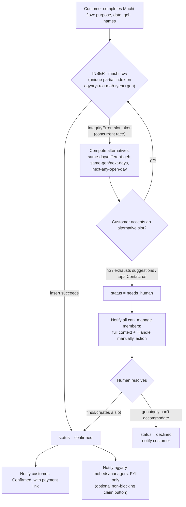
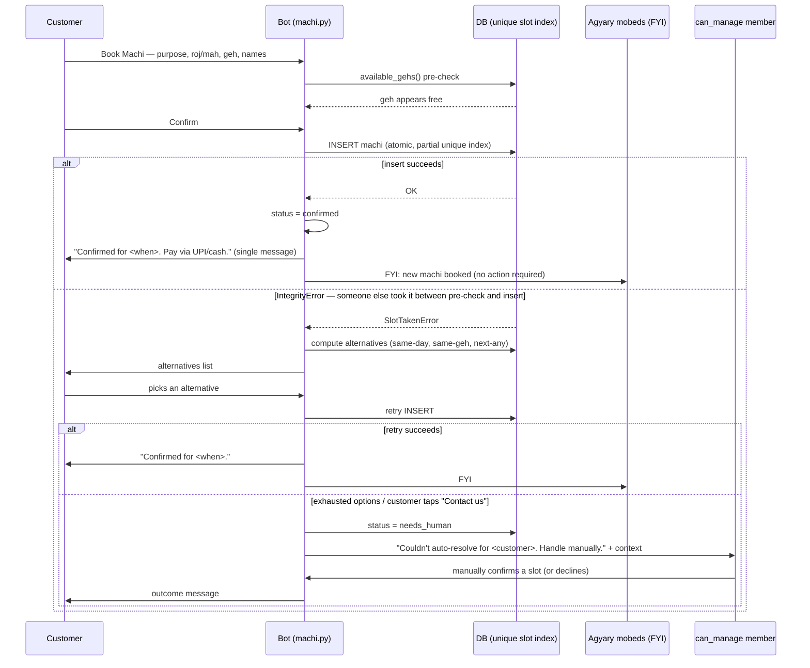
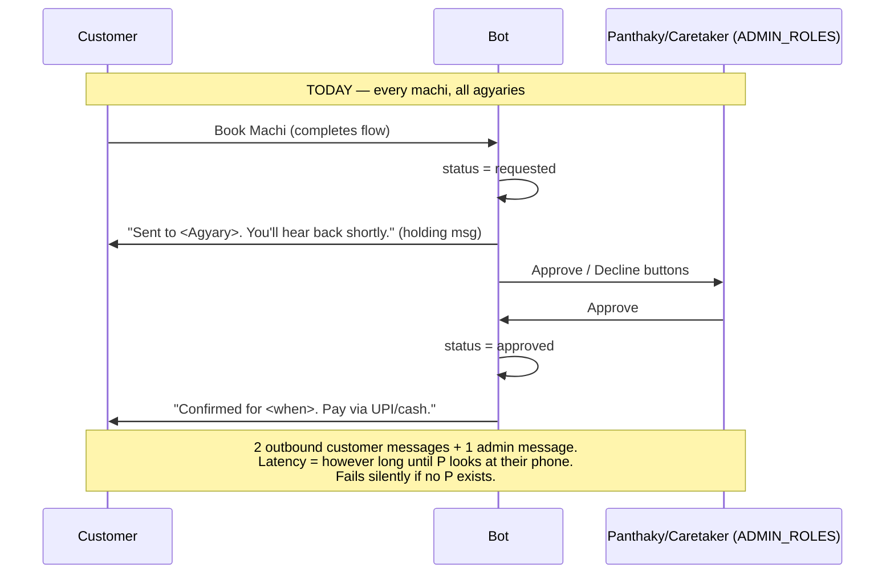
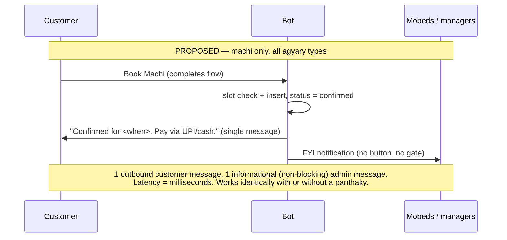

# Design: Peer-Mobed Role Model + Automatic Machi Booking

Status: DESIGN ONLY — no implementation. Companion to `01-system-architecture.md` /
`02-backend-api.md` / `03-frontend-ux.md`. Read against `src/agyary/` as of this
session; specific line references below were verified against the current tree.

## 0. Grounding: what's actually implemented today (not what the docs describe)

Before proposing changes, one correction to the mental model: the v2 docs (`01-system-architecture.md:230,306,317-326`) describe a two-stage gate for machis — panthaky approves, *then* assigns a mobed, with optional accept/decline. **None of the assignment stage exists in code.**

- `Machi.assigned_mobed_id` (`models/machi.py:61`) is declared and indexed, but no code path ever sets it. Grepping the whole `src/` tree for writes to it returns zero hits outside the model/index definition.
- `Agyary.require_mobed_acceptance` (`models/agyary.py:42`) is stored but never read anywhere in `messaging/` or `api/`.
- `BOOKING_MOBED_STATUSES` / `BookingMobed` exist and are used for non-machi service bookings (`messaging/flows/service.py` implies multi-mobed yazeshni), but machis never touch them.
- What *does* exist and works today: `approval.py` gates every machi at `requested → approved` via a panthaky/caretaker button tap, and stops there. Mobed dispatch is a real-world phone-call problem the software doesn't touch yet.

This matters for scoping: we are not unwinding a working assignment system. We're removing a single approval gate that was never followed by the assignment logic the docs promised, and building the mobed-membership layer from scratch (no prior art in this codebase).

## 1. What this breaks

| Area | Current assumption | Where it lives | Why it breaks |
|---|---|---|---|
| Role model | Every agyary has ≥1 user with role `panthaky` or `caretaker` (`ADMIN_ROLES`) | `models/enums.py:9-10` | Peer-mobed agyaries have zero rows with either role. `ADMIN_ROLES` is not just a display label — it's the sole authorization predicate. |
| `AgyaryUser` | Membership = `(agyary_id, user_id, role)`, one role per user per agyary, binary `is_active` | `models/user.py:35-52` | No concept of *capability* independent of role, no invite/pending state, no way to say "this mobed is roughly-equal but also handles admin duties." |
| `get_admins()` / `is_admin_phone()` | "Admin" = has role in `ADMIN_ROLES` | `messaging/booking_service.py:73-88`, reused by `api/routes/chat.py:42-52` | Returns `[]` for panthaky-less agyaries. Every caller degrades silently — see next row. |
| `approval.py` | Someone in `ADMIN_ROLES` will always be reachable to tap Approve/Decline | `messaging/flows/approval.py:35-41` | If `get_admins()` is empty, `machi.py` still creates the machi at `status="requested"` and fires zero approve/decline buttons (`machi.py:665-675` iterates an empty list — no error, no message, no one notified). The booking silently rots in `requested` forever; only a platform admin poking the DB directly can unstick it. This is a live bug today for any panthaky-less agyary, not a hypothetical. |
| `CEREMONY_STATUSES` | `requested → approved → assigned → …` — every machi passes through a human decision before the customer is told anything definitive | `models/enums.py:13-22` | Contradicts the "fully automatic" requirement outright. `requested`/`approved`/`assigned` encode a two-stage human workflow (decide, then dispatch) that shouldn't exist for machis at all going forward. |
| WhatsApp flow: machi confirm | Customer gets a holding message ("sent, you'll hear back"), admin gets Approve/Decline, customer gets a second message on resolution | `messaging/flows/machi.py:646-676` | Structurally requires an `ADMIN_ROLES` member to exist and be responsive. Adds one full message round-trip (and its ₹0.30–0.50 WhatsApp template cost, per the project's own cost-sensitivity note in `Agyary Management System v2.md:16`) to every single booking, for a decision (`is the geh free?`) the system can already answer itself. |
| WhatsApp flow: admin notifications generally | Every admin-facing notification in the codebase assumes a human decision is pending (Approve/Decline) — there is no "FYI, no action needed" notification shape today | `machi.py:666-675`, `approval.py` | The new model needs a second, weaker notification class (informational) alongside the existing action-required one; today there's only the latter. |

## 2. Proposed actor/role model

The core fix: **stop conflating "what role are you" with "can you approve/manage."** Today `ADMIN_ROLES` does both. Split them.

### 2.1 Three layers, not one

| Layer | Scope | New/existing | Purpose |
|---|---|---|---|
| `User.is_platform_admin` | System-wide, cross-tenant | New column on existing `users` table | Anthropic-you's own ops team. Onboards new agyaries, resolves disputes, is the fallback approver of last resort when an agyary has *zero* capable members (e.g. mid-onboarding). Not exposed over WhatsApp — API/PWA only, separate auth path. Out of scope for the chat flows below except as a backstop. |
| `AgyaryUser.role` | Per-tenant, descriptive | Existing (`panthaky`/`mobed`/`caretaker`), unchanged values | Still answers "what are you here" — kept for display, earnings categorization, and as a sane default when granting capability (see below). No longer used for authorization by itself. |
| `AgyaryUser.can_manage` | Per-tenant, capability | **New boolean column** | The actual authorization predicate. Replaces `role IN ADMIN_ROLES` everywhere. Panthaky-led agyaries: `can_manage=true` for panthaky/caretaker rows, `false` for mobeds (identical behavior to today, just re-expressed). Peer-mobed agyaries: `can_manage=true` on one or more `mobed`-role rows — a mobed who also handles admin duties, without pretending to be a "panthaky" that doesn't exist. |

Migration is purely additive:

```sql
ALTER TABLE agyary_users ADD COLUMN can_manage BOOLEAN NOT NULL DEFAULT false;
UPDATE agyary_users SET can_manage = true WHERE role IN ('panthaky', 'caretaker');
```

No existing row's behavior changes. `ADMIN_ROLES` in `enums.py` is demoted from an authorization list to a UX default ("I'm the panthaky" during signup pre-checks the `can_manage` box) — it stops being read by `booking_service.get_admins()`.

### 2.2 Membership lifecycle (new — doesn't exist today)

`AgyaryUser` currently only has `is_active` (on/off). It has no notion of *not yet active*. Add:

```
AgyaryUser.membership_status: invited | pending_approval | active | removed
```

(`is_active` kept as-is for the existing offboarding semantics; `membership_status` is the new onboarding state machine layered on top — additive, doesn't touch existing reads that only check `is_active`.)

Two ways a mobed joins, both landing in this state machine:

1. **Targeted invite** — any `can_manage=true` member sends an invite bound to a phone number. New table `AgyaryInvite(id, agyary_id, phone, role, invited_by_user_id, token, status, expires_at)`. Invitee gets a WhatsApp message with an Accept button; accepting creates the `AgyaryUser` row directly at `active`.
2. **Self-registration by phone** — gated by a new `Agyary.open_mobed_registration: bool` (default `false`, so this is opt-in per tenant, not a blanket door-opener). An unrecognized phone sending a join keyword (or scanning an agyary-specific QR/link) creates an `AgyaryUser` at `pending_approval`. Any existing `can_manage=true` member approves it with a button tap. If none exists yet (brand-new agyary, or every manager went inactive), it escalates to a platform admin — this is the one place the system-level layer touches an ordinary onboarding flow.

This directly answers "roughly as equals": a mobed never needs a panthaky's permission to exist in the system — they need *any* capable peer's approval, or the platform admin as backstop. No agyary is ever permanently un-manageable.

### 2.3 What does NOT change

`Customer`, `AgyaryCustomer`, `CustomerSavedName`, `Payment`, `Service`, `BookingMobed`, `BOOKING_MOBED_STATUSES`, and the entire non-machi `service.py` booking flow are untouched by this proposal. The approval gate for *services* (jashan, navjote, etc.) stays exactly as it is — the user's ask was machi-specific, and services have real scheduling complexity (multiple mobeds, offsite location, yazeshni needing 2) that genuinely benefits from a human look before confirming. Conflating that with machi's binary slot-check would be scope creep.

## 3. Automatic machi booking — flowchart

The good news, flagged in §0: the rule engine this needs is **already built**. `available_gehs()`, `next_days_with_geh()`, `next_days_with_any_geh()` (`messaging/availability.py`), the partial-unique-index-on-status (`models/machi.py:107-118`), and `SlotTakenError` (`messaging/booking_service.py:37,256-261`) already do exactly the atomic "is it free, and if not, what's next" work the automatic flow needs. What's missing is wiring the *final* confirm step to trust that machinery instead of routing through a human first.



Key property: the only path that reaches a human is the double-failure case (auto-suggestions also raced or the customer rejects all of them) or an explicit ask. In steady state, zero humans are in the loop.

## 4. Sequence diagrams

### 4.1 Mobed invite / onboarding into an agyary

```mermaid
sequenceDiagram
    participant M as Existing can_manage member
    participant Bot as WhatsApp bot
    participant DB as DB
    participant Mo as New mobed (phone)
    participant PA as Platform admin (backstop)

    rect rgb(240,240,255)
    Note over M,Mo: Path A — targeted invite
    M->>Bot: "Invite mobed +91XXXXXXXXXX"
    Bot->>DB: INSERT AgyaryInvite(status=invited, phone, role=mobed)
    Bot->>Mo: "You've been invited to join <Agyary> as a mobed. Accept?"
    Mo->>Bot: taps Accept
    Bot->>DB: upsert User(phone); INSERT AgyaryUser(role=mobed, can_manage=false, membership_status=active)
    Bot->>M: "Mobed <name> has joined <Agyary>"
    Bot->>Mo: welcome message + how the slot calendar works
    end

    rect rgb(255,245,235)
    Note over Mo,PA: Path B — self-registration (open_mobed_registration=true)
    Mo->>Bot: "join as mobed" (or agyary-specific QR/link)
    Bot->>DB: INSERT AgyaryUser(membership_status=pending_approval)
    Bot->>M: "New mobed <phone> wants to join. Approve?"
    alt no can_manage member exists at this agyary
        Bot->>PA: escalate pending registration
        PA->>Bot: Approve
    else at least one exists
        M->>Bot: taps Approve
    end
    Bot->>DB: AgyaryUser.membership_status = active
    Bot->>Mo: welcome message
    end
```

### 4.2 Automatic machi booking, end-to-end, with fallback



### 4.3 WhatsApp message-flow shape: old (approve/decline) vs new (automatic)





Net effect per booking: customer messages drop from 2 → 1, the admin message changes from action-required to informational, and the only latency is the DB round-trip — directly addressing the per-message cost sensitivity called out in the v2 doc (`Agyary Management System v2.md:16`).

## 5. Mobed ↔ machi relationship without an assignment step

The open question: once there's no approval/assignment gate, how do mobeds relate to a booked machi?

**Recommendation: booking stays agyary-scoped, not mobed-scoped; `assigned_mobed_id` becomes post-hoc and optional, never a gate.**

- The customer books a slot *at the agyary*, exactly as `machi.py` already does today — the flow never asks "which mobed." That's correct and shouldn't change: which mobed physically performs a given roj/geh is a duty-roster problem, not a booking problem, and conflating the two is how you accidentally rebuild the approval bottleneck under a new name.
- All active mobeds at an agyary get read access to the shared slot calendar (necessary once there's no dispatcher deciding who does what).
- `assigned_mobed_id` (already on the `Machi` model, already unused) is repurposed as an **optional, non-blocking, after-the-fact** field: either filled in post-ceremony for earnings/reporting, or claimable via a first-tap-wins button on the informational FYI notification sent in §4.2. Either way it never blocks the customer's confirmation — confirmation already happened.
- Does "claiming" need to exist at all? Only as a convenience for earnings attribution and duty tracking, not as a workflow gate. Make it optional. If an agyary later wants stronger rostering (rotation, fairness, load-balancing across peer mobeds), that's a genuinely separate feature layered on top of this field later — not a prerequisite for shipping automatic booking.

## 6. Rule-based vs. local LLM

Argued per-decision, not assumed:

| Decision point | Recommendation | Reasoning |
|---|---|---|
| Is the geh free? | **Rule-based.** Non-negotiable. | Boolean set-membership query against a DB unique index. Deterministic, must be 100% correct and race-safe (this is a religious/financial commitment), and needs to be auditable when a caretaker asks "why did it say confirmed." An LLM adds latency, cost, and non-determinism to what is today literally a `WHERE` clause. There's no version of this where an LLM is even a lateral move, let alone an improvement. |
| Which alternative to suggest first? | **Rule-based** (fixed priority: same-day/diff-geh → same-geh/next-days → next-any-day). | Small, enumerable option space (`availability.py` already implements exactly this ordering). A fixed priority is fully explainable to a non-technical caretaker, trivially unit-testable, and there's no meaningful "preference" signal yet to justify learning a ranking. Revisit only if usage data later shows customers consistently reject the rule-based ordering. |
| When to escalate to a human? | **Rule-based** (retry-count threshold + explicit "Contact us" tap + agyary-level flags). | Escalation triggers need to be enumerable and reliable — an LLM "deciding" whether to wake a mobed at 6am on a fuzzy confidence score is a liability, not a feature. Keep it a small decision table. |
| Composing the human-fallback notification | **Rule-based / templated**, as today. | `formatting.py`'s `date_label`/`geh_label` helpers already do this deterministically and cheaply. The fallback reasons are few and enumerable; a template covers them. |
| Free-text date/purpose parsing at intake | **Already rule-based and out of scope.** `date_parser.py`/`name_parser.py` already handle Parsi-calendar vocabulary and mixed English/Gujarati input via hand-rolled parsers. An LLM *could* add robustness to typos/phrasing variance, but that's a pre-existing, orthogonal improvement opportunity — not something this redesign needs or should bundle in. |
| Duty-roster optimization (who should be on duty, fairness/rotation across peer mobeds) | **Legitimate future candidate, not v1.** | This is genuinely a preference-learning / combinatorial-optimization problem, unlike the above, which are all lookups. But it's downstream of this redesign — it needs the optional claiming/roster data from §5 to exist first, and shouldn't gate shipping automatic booking. |

**Bottom line: zero LLM in the critical booking path for v1.** Every decision the automatic-booking flow needs to make is a lookup or a fixed-priority sort over a small, well-understood space — the kind of problem where an LLM would be strictly worse (slower, non-deterministic, harder to audit for a religious-institution client, and an unjustified infra cost against the project's own stated 30–50 paisa/message economics). Local-LLM investment is better spent later, if at all, on intake-parsing robustness or roster fairness — both separable, both post-v1.

## 7. Effort / blast-radius assessment

### 7.1 Schema (all additive — no breaking migration, no data loss)

| Change | Type | Size |
|---|---|---|
| `agyary_users.can_manage` (+ backfill from role) | Additive column | S |
| `agyary_users.membership_status` (invited/pending_approval/active/removed) | Additive column | S |
| `agyaries.open_mobed_registration` | Additive column | S |
| New table `agyary_invites` | Additive table | M |
| `users.is_platform_admin` | Additive column | S |
| `enums.CEREMONY_STATUSES` += `confirmed`, `needs_human` | Additive CHECK-constraint value (the schema is explicitly designed for this — `enums.py:1-5` docstring: "adding a value is an in-place constraint swap, never a type migration") | S |

Nothing existing is renamed or dropped. `approved`/`assigned`/`requested`/`declined` stay valid values (services keep using them; historical machi rows keep meaning what they meant).

### 7.2 Code

| File | Change | Type | Size |
|---|---|---|---|
| `models/user.py` | add `can_manage`, `membership_status` to `AgyaryUser`; `is_platform_admin` to `User` | Additive | S |
| `models/agyary.py` | add `open_mobed_registration` | Additive | S |
| `models/enums.py` | extend `CEREMONY_STATUSES`; demote `ADMIN_ROLES` to a UX-default hint, stop treating it as authoritative | Additive + one semantic change | S |
| New `models/invite.py` (`AgyaryInvite`) | New model | New | M |
| `messaging/booking_service.py` `get_admins()`/`is_admin_phone()` | Query `can_manage=true` instead of `role IN ADMIN_ROLES` | Behavior change, 1 function pair, 4 call sites to re-verify (`chat.py`, `approval.py`, `welcome.py::contact_message`, `machi.py` notify block) | M |
| `messaging/flows/machi.py` `_step_confirm` tail (lines ~610–676) | Remove approve/decline button send; branch on insert success → `confirmed`, or race/exhaustion → alternatives → `needs_human` | **Core logic change** | L |
| `messaging/flows/approval.py` | Narrow to `entity == "booking"` only; machi branch becomes dead code post-cutover (safe to leave for any in-flight `requested` machis rather than force-migrate them) | Scope reduction, low risk | S |
| New `messaging/flows/mobed_onboarding.py` | Invite-accept + self-registration conversation flow | **New, no prior art in codebase** — there is currently zero user-facing (non-customer) conversation flow; all `User`-side interaction today is stateless button taps (`approval.py`) | L |
| `messaging/handler.py::_route` | Add routing branches for invite-accept token/keyword and join-request keyword | Additive branch | M |
| `api/routes/chat.py` | Admin listing should reflect `can_manage`, not `ADMIN_ROLES` | S | S |
| `messaging/flows/service.py`, `booking.py`, `BOOKING_MOBED_STATUSES`, `require_mobed_acceptance` | **Untouched.** Non-machi services keep the existing approval-gated flow exactly as-is. | None | — |

### 7.3 Tests (audited, not guessed)

`tests/test_chat_flow.py` has 5 direct assertions tied to the old machi status machine (`approve_machi_` id at line 53, `status == "requested"` at 56/95, `status == "approved"` at 82) that need rewriting for the new `confirmed`/`needs_human` states. Its `booking.status == "requested"/"approved"` assertions (lines 197, 210) are for **services**, not machis, and stay untouched. `test_review_fixes.py` and `test_whatsapp_webhook.py` reference machi/approval concepts but had no direct hits on the specific status/action-id patterns grepped — worth a manual pass rather than assuming they're clean, since a keyword miss doesn't guarantee no coupling.

### 7.4 Overall sizing

Panthaky-led agyaries see **zero behavior change** post-migration (their `panthaky`/`caretaker` rows get `can_manage=true` automatically, they just stop getting machi approve/decline prompts — services are unaffected). The bulk of the effort is two independent, parallelizable workstreams: (1) rewriting the machi confirm tail to trust the already-built availability engine (medium — mostly deletion + rewiring existing pieces), and (2) building the mobed-membership/invite layer from nothing (large — genuinely new surface area, first user-facing conversation flow for `User` rows in this codebase). Rough order of magnitude: **1–2 weeks** for a single engineer familiar with the codebase, split roughly 30/70 between the two workstreams — the automatic-booking piece is smaller than it looks because the hard part (atomic slot check + alternatives) already exists; the membership/invite piece is the real net-new build.

## 8. Open items for a follow-up pass (not blocking this design)

- Exact wording/UX of the FYI notification and the optional claim button — belongs in a `03-frontend-ux.md`-style pass once this model is approved.
- Whether `needs_human` machis should notify *all* `can_manage` members simultaneously or round-robin — a policy choice, not an architecture one.
- Rate-limiting/anti-abuse on `open_mobed_registration` self-service joins (e.g. cap pending requests per agyary) — worth a line item before enabling it by default anywhere.
