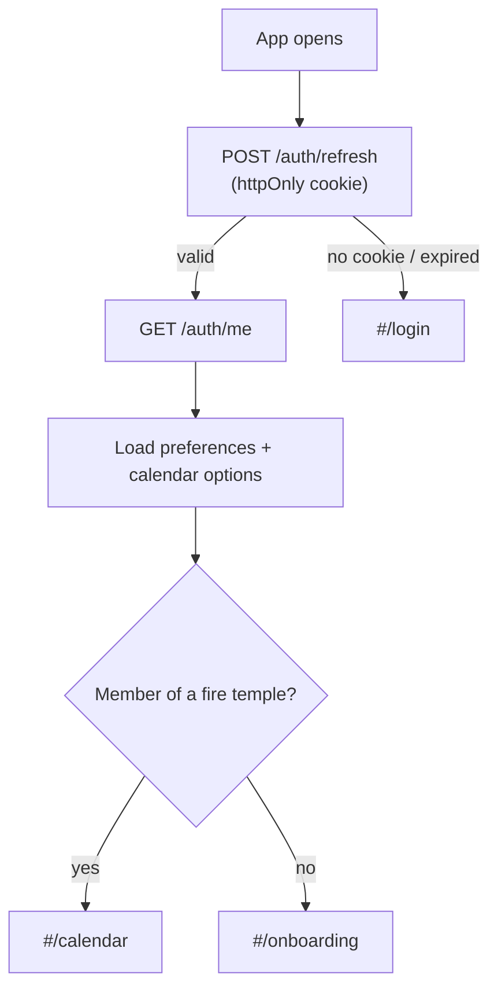
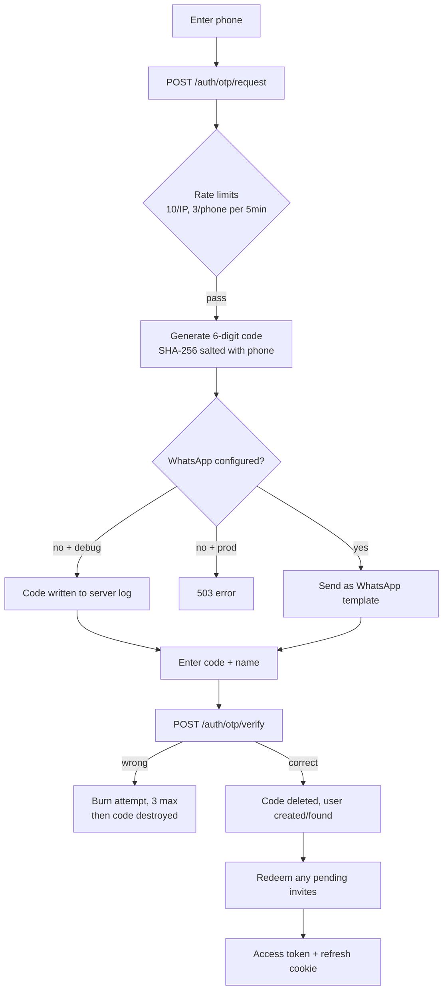
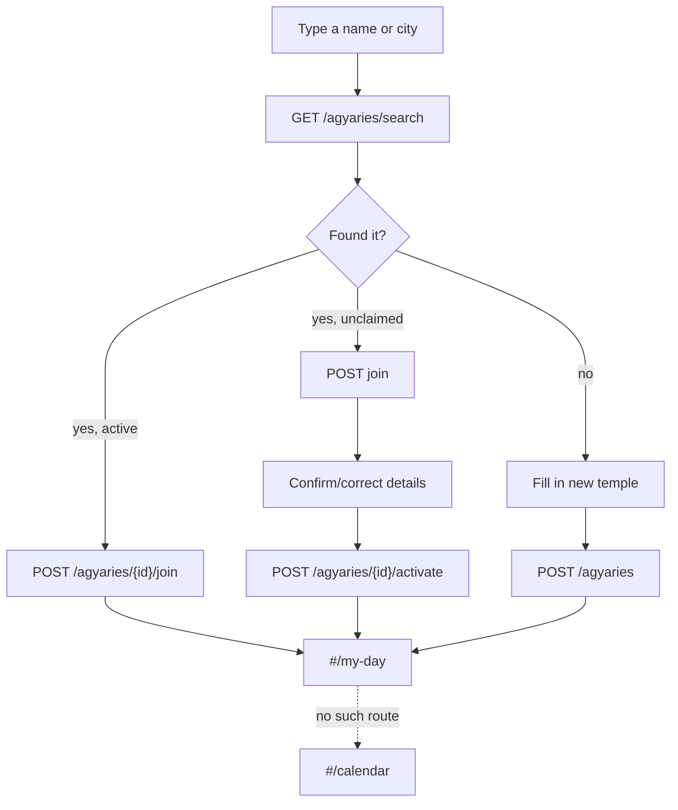
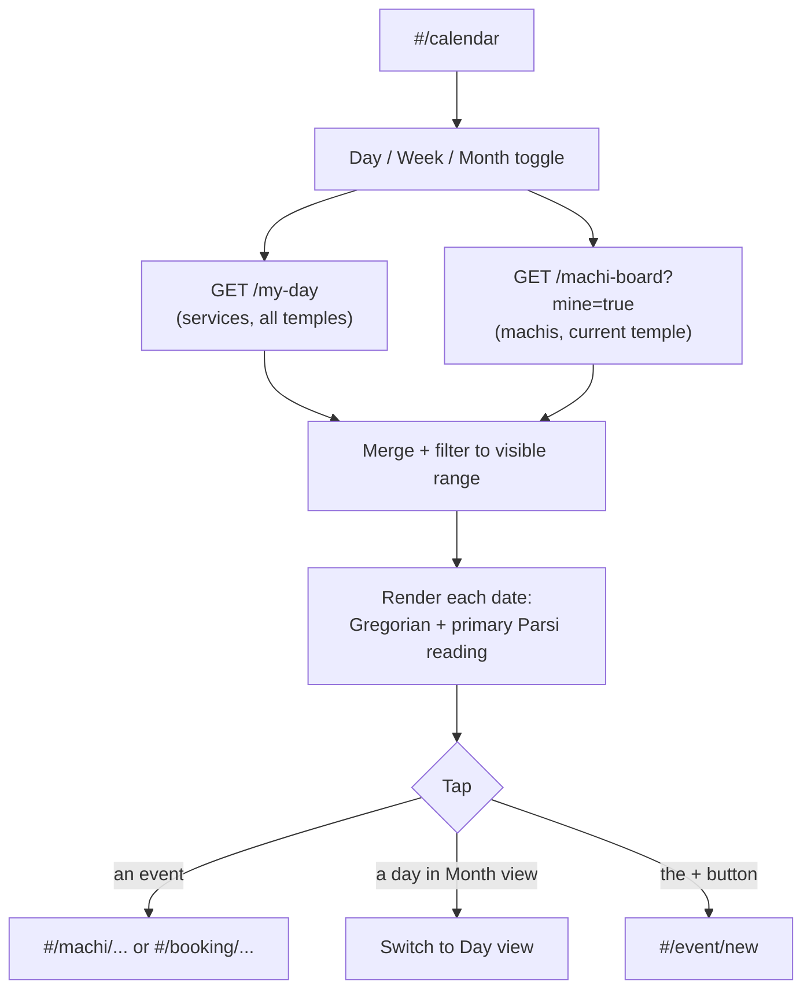
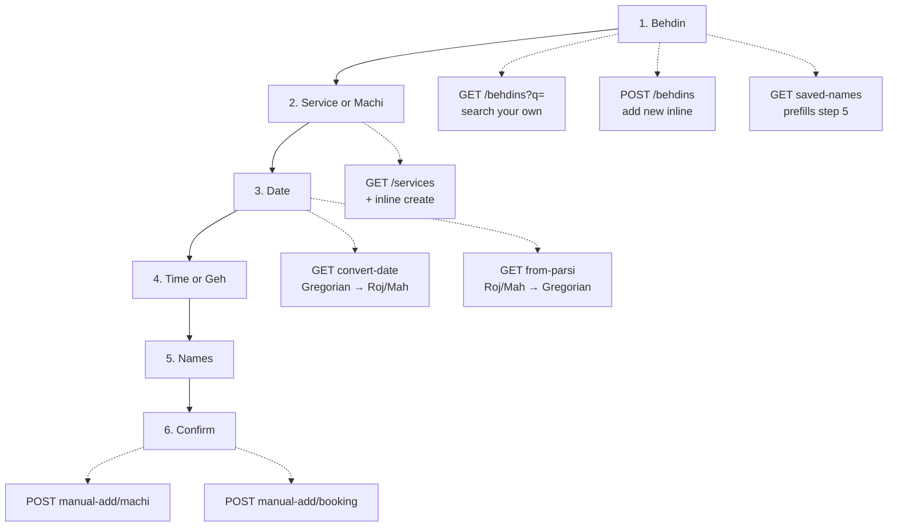
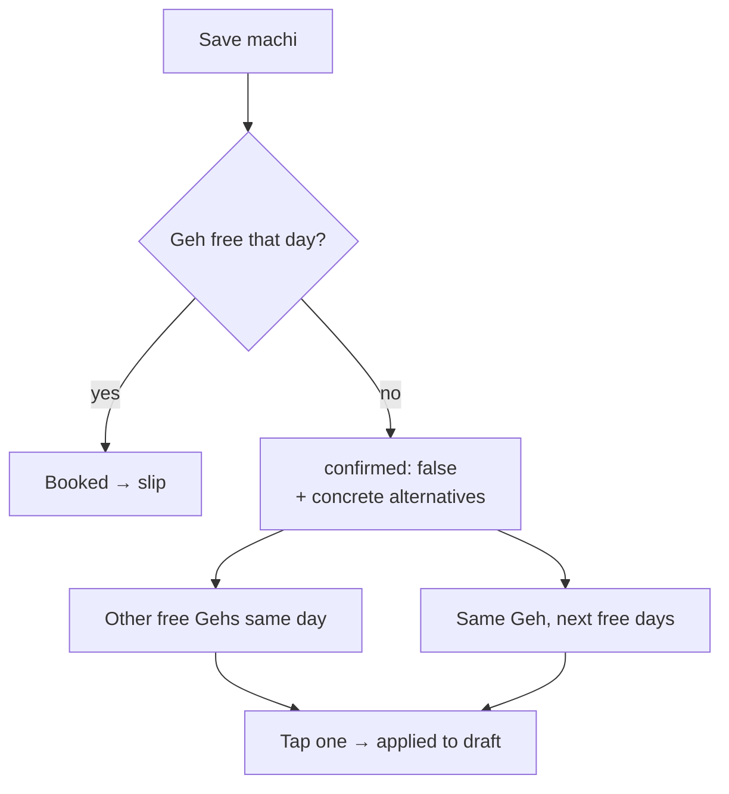
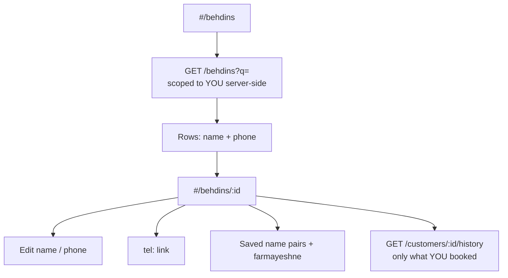
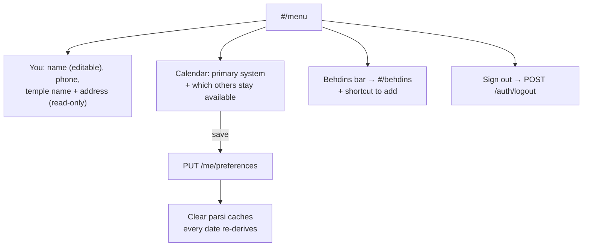

# Mobed Diary — app audit

State of the code as it actually is on `master` @ `f18ad1c`. Not what the
scope says; what the files do.

---

## 1. Route map

| Hash route | Screen | File |
|---|---|---|
| `#/login` | Sign in (phone + OTP) | `js/screens/login.js` |
| `#/onboarding` | Fire-temple search / join / create | `js/screens/onboarding.js` |
| `#/calendar` | **Home.** Day / Week / Month | `js/screens/calendar.js` |
| `#/menu` | You / Calendar / Behdins | `js/screens/menu.js` |
| `#/event/new` | 6-step new-event wizard | `js/screens/event.js` |
| `#/event/:kind/:id/edit` | Same wizard, prefilled | `js/screens/event.js` |
| `#/behdins` | Behdin list | `js/screens/behdins.js` |
| `#/behdins/:id` | Behdin detail | `js/screens/behdins.js` |
| `#/machi/:aid/:id` | Printable slip | `js/screens/slip.js` |
| `#/booking/:aid/:id` | Printable slip | `js/screens/slip.js` |

**No route:** `js/screens/invites.js` — file exists, unreachable.
**Anything unrecognised** → redirected to `#/calendar`.

---

## 2. Cold start

The refresh cookie is **sliding, 180 days** — re-issued on every refresh
(`routes/mobed.py:177`). A mobed who opens the app even twice a year never
sees the login screen again.

---

## 3. Sign-in (current — this is what we're replacing)

**Blocked:** the WhatsApp template send is written but has never worked —
a test WABA cannot create templates, and authentication messages are
billable. See scope §8.1/8.1a/8.1b.

---

## 4. Onboarding

Any signed-in user can **create** a fire temple and **edit** an unclaimed
one. See finding #3.

---

## 5. Calendar (home)

`mine=true` is hardcoded client-side (`api.js:100`) — the mobed app never
pulls the temple-wide board.

---

## 6. New event — the 6-step wizard

**Date step:** Gregorian and Roj/Mah are two views of one value. Either is
editable; **neither is ever computed in the browser** — every change round-trips
to the server. Roj/Mah is read and written in the **mobed's primary calendar**
(`event.js:46`).

**Machi clash:**

Machi is blocked on Gatha days and is never offsite.

---

## 7. Behdins

Scoping is enforced in `services/behdin_directory.py` (`search_mine`,
`get_scoped`) — not in the client. A behdin who isn't yours returns **404,
not 403**, so you can't probe whether a person exists.

Two add entry points, one component (`behdin_add.js`): the `+` on this
screen, and the `+` on the menu's Behdins bar.

---

## 8. Menu

---

## 9. API surface

**Used by the app:**

`/auth/otp/request` · `/auth/otp/verify` · `/auth/refresh` · `/auth/logout` ·
`/auth/me` (GET, PATCH) · `/me/preferences` (GET, PUT) ·
`/agyaries/search` · `/agyaries` · `/agyaries/{id}/join` · `/agyaries/{id}/activate` ·
`/my-day` · `/agyaries/{id}/machi-board` · `/agyaries/{id}/services` (GET, POST) ·
`/agyaries/{id}/behdins` (GET, POST, GET id, PATCH) · `/agyaries/{id}/behdins/{cid}/saved-names` ·
`/customers/{id}/history` · `/agyaries/{id}/manual-add/machi` · `/agyaries/{id}/manual-add/booking` ·
`/agyaries/{id}/machis/{id}` (detail, slip, PUT) · `/agyaries/{id}/bookings/{id}` (detail, slip, PUT) ·
`/reference/calendar-options` · convert-date / from-parsi

**Live but nothing calls them:**

| Endpoint | Note |
|---|---|
| `POST/GET/DELETE /agyaries/{id}/invites` | Finding #2 |
| `GET /pending-requests` | WhatsApp booking-request flow, off |
| `POST /bookings/{id}/accept` / `decline` | same |
| `GET /agyaries/{id}/bookable-gehs` | was the Geh slot board, removed |
| `GET /customers/search` | superseded by `/behdins` |
| `GET /agyaries/{id}/form-options` | superseded by `/services` |
| `PATCH /agyaries/{id}/services/{id}` | catalog editing, no UI |
| `/webhooks/whatsapp` | mounted; behdin bot routing behind it |

---

## 10. Findings — where changes are needed

| # | What | Where | Severity |
|---|---|---|---|
| 1 | **Sign-in doesn't work in production.** WhatsApp OTP needs a template a test WABA can't create, plus billing. Decision pending: inbound-WhatsApp sign-in. | `services/otp_delivery.py`, `routes/mobed.py:99` | **Blocker** |
| 2 | **Invite API is live with no UI.** Any signed-in mobed at a temple with no admin can issue `panthaky`/`caretaker` roles by curl. Scope §5 says invites are unreachable — that's true of the screen, not the endpoints. | `routes/mobed.py:473-553` | **High** |
| 3 | **Onboarding writes to the temple table.** Any user can `POST /agyaries` (create) or `activate` an unclaimed one — no verification that they work there. Scope §5 says fire-temple editing is unreachable; it isn't. | `routes/mobed.py:385,414` | **High** |
| 4 | **Phone numbers stored in plaintext** — mobeds' and behdins'. Needs encryption at rest + HMAC blind index, because behdins are looked up by phone. | `models/user.py:27`, customers table | **High** |
| 5 | `#/my-day` **is navigated to but has no route.** Four call sites bounce through not-found → `#/calendar`. Works by accident. | `session.js:45`, `onboarding.js:76,109,148`, `event.js:174` | Medium |
| 6 | **Scope §8.3 is stale.** It says the event form reads the temple's calendar system; it was fixed and now reads the mobed's primary. §4.1 row 7 already says so. The two contradict. | `11-mobed-app-scope.md:258` | Medium |
| 7 | **Scope §5 says the service catalog is unreachable, but the wizard creates services.** Step 2 has "+ Add a new service" wired to `POST /services`. Either the doc or the wizard is wrong. | `event.js:309`, scope §5 | Medium |
| 8 | **Machi purpose renders as a raw key** — "Machi (patet)" instead of "Machi (Patet — for the departed)". `MACHI_PURPOSE_DISPLAY` exists and is used everywhere else. | `calendar.js:44` | Low |
| 9 | **Calendar mixes scopes.** `/my-day` returns services across every temple; `machi-board` only the current one. Harmless while one mobed = one temple, wrong the moment that isn't true. | `calendar.js:49` | Low |
| 10 | **Dead references.** `invites.js` links back to `#/settings`, which doesn't exist. | `invites.js:57` | Low |

---

## 11. Not built at all

- Global daily send cap on OTP (scope §8.1b) — moot if OTP goes.
- The behdin-facing WhatsApp bot. Code is in `messaging/`; webhook is mounted
  but the app never surfaces any of it.
- Any agyari management surface. Deliberate — waiting on real panthakies.
